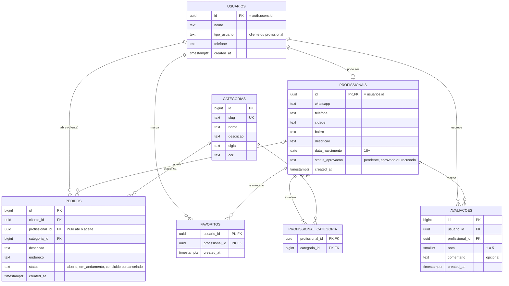

# TRABALHO DE PROJETO INTEGRADOR

## Help me

**Hub de Contatos de Emergência para Serviços Residenciais**

Trabalho desenvolvido durante a disciplina de Projeto Integrador.

---

# Sumário

1. Componentes
2. Ideias Selecionadas, Matriz de Seleção e Opportunity Card
   2.1 Ideias Selecionadas pelo Grupo
   2.2 Matriz de Seleção
   2.3 Opportunity Card da Ideia Selecionada
3. Minimundo
4. Validação da Ideia
5. Personas e Histórias de Usuário
6. Protótipos do Sistema
   6.1 Protótipo do Sistema Mobile
   6.2 Protótipo do Sistema Web
   6.3 Perguntas que podem ser respondidas pelo Sistema
7. Modelo Conceitual
8. Descrição dos Dados
9. Rastreabilidade dos Artefatos
10. PMC

---

# 1. COMPONENTES

## Integrantes do grupo

* Bruno Alves 
* Lucas dos Santos Felipe
* Davi Souza
* Luiz Felipe Moro 
* Welcson
* Gabriel

---

# 2. IDEIAS SELECIONADAS, MATRIZ DE SELEÇÃO E OPPORTUNITY CARD

## 2.1 Ideias Selecionadas pelo Grupo

Após a realização da dinâmica prática 5–5–5, envolvendo problemas, soluções atuais e pessoas, o grupo analisou as possibilidades levantadas e selecionou duas ideias para avaliação.

**Ideia 1:** Hub de Contatos de Emergência para Serviços Residenciais.

**Ideia 2:** Uma agenda de lembretes para as pessoas via whatszap  

---

## 2.2 Matriz de Seleção

A matriz de seleção foi utilizada para comparar as ideias levantadas pelo grupo considerando critérios de afinidade, processo, problema, valor do software e viabilidade.

### Ideia 1: Hub de Contatos de Emergência para Serviços Residenciais

Afinidade: 5
Processo: 4
Problema: 5
Valor do software: 5
Viabilidade: 4
Nota final: 23

## 2.3 Opportunity Card da Ideia Selecionada

A ideia selecionada pelo grupo foi o **Hub de Contatos de Emergência para Serviços Residenciais**, cujo objetivo é facilitar a localização de profissionais que prestam serviços relacionados à manutenção e reparos em residências.

### 1. Área de afinidade/contexto

Serviços residenciais, manutenção doméstica e localização de profissionais para reparos e necessidades emergenciais em residências.

### 2. Problema percebido

Em situações que exigem reparos ou serviços em uma residência, pode ser difícil encontrar rapidamente um profissional adequado e confiável para realizar o serviço necessário.

### 3. Quem possui o problema

Pessoas que precisam contratar profissionais para realizar serviços de manutenção, reparo ou melhorias em suas residências.

### 4. Como é resolvido hoje

Atualmente, as pessoas podem procurar profissionais por meio de indicações de conhecidos, pesquisas na internet, redes sociais, grupos de mensagens ou outros meios de divulgação.

### 5. Soluções semelhantes

Existem diferentes formas de encontrar profissionais, como mecanismos de busca, redes sociais, grupos de mensagens e plataformas de prestação de serviços.

### 6. Lacuna inicial

A oportunidade identificada está na criação de um sistema que reúna contatos de profissionais de diferentes serviços residenciais em um único ambiente, facilitando a busca de acordo com a necessidade do usuário.

### 7. Pessoas acessíveis

Usuários que possuem residência e que já tenham precisado ou possam precisar de serviços de manutenção, reparos ou profissionais especializados.

### 8. Hipótese de oportunidade

Um sistema que organize profissionais por categorias de serviço e disponibilize suas informações de contato pode facilitar a localização de profissionais para serviços residenciais.

### 9. Fomento/oportunidade

A necessidade frequente de serviços residenciais e a dificuldade de localizar rapidamente profissionais podem gerar uma oportunidade para centralizar essas informações em um sistema.

### 10. Principal incerteza/desafio

O principal desafio é garantir que as informações dos profissionais sejam organizadas de maneira adequada e que o sistema facilite a localização do profissional correspondente à necessidade do usuário.

---

# 3. MINIMUNDO

O sistema proposto consiste em um hub de contatos para auxiliar usuários na localização de profissionais que realizam serviços residenciais. O sistema disponibilizará profissionais organizados de acordo com suas categorias de atuação. As categorias inicialmente definidas são: encanador, eletricista, chaveiro, pedreiro, pintor e gesseiro.

O usuário poderá acessar o sistema e procurar profissionais de acordo com a categoria de serviço desejada. Cada profissional possuirá informações para identificação e contato, como nome, telefone, WhatsApp, cidade, bairro, descrição e data de cadastro.

Um profissional poderá atuar em uma ou mais categorias de serviços. As categorias também poderão existir mesmo quando não houver profissionais cadastrados nelas.

O sistema possuirá usuários cadastrados, que poderão avaliar profissionais utilizando notas de 1 a 5 e, opcionalmente, adicionar comentários. Também será possível trabalhar com profissionais favoritos.

As informações serão armazenadas de forma estruturada para evitar redundâncias e facilitar o gerenciamento dos dados. O contato entre usuário e profissional será realizado por telefone ou WhatsApp, não sendo realizado diretamente dentro do sistema.

---

# 4. VALIDAÇÃO DA IDEIA

## a) Link do formulário desenvolvido

https://forms.gle/82FE6vKrh13Zr4Ga8

## b) Link para relatório/apresentação dos resultados

https://docs.google.com/spreadsheets/d/1OQdhV9Ebo00NHDXoFNafWilqB2EnDiGGN4UX5VHgwVE/edit?usp=sharing

---

# 5. PERSONAS E HISTÓRIAS DE USUÁRIO

## 5.1 Personas

As personas desenvolvidas pelo grupo representam possíveis usuários do sistema e suas necessidades relacionadas à busca por profissionais para serviços residenciais.

### Persona 1 — Gabriel

* Idade: 17 anos
* Ocupação: Estudante
* Necessidade: [PREENCHER COM A DESCRIÇÃO DEFINIDA PELO GRUPO]

### Persona 2 — Mariana

* Idade: 29 anos
* Ocupação: Assistente administrativa
* Necessidade: [PREENCHER]

### Persona 3 — Roberto

* Idade: 45 anos
* Ocupação: Professor
* Necessidade: [PREENCHER]

### Persona 4 — Ana

* Idade: 24 anos
* Ocupação: Universitária
* Necessidade: [PREENCHER]

### Persona 5 — Carlos

* Idade: 38 anos
* Ocupação: Pequeno empreendedor
* Necessidade: [PREENCHER]

---

## 5.2 Histórias de Usuário

As histórias de usuário devem representar as principais necessidades identificadas nas personas e estar relacionadas diretamente às funcionalidades previstas no sistema.

**HU01 — Buscar profissional**

Como usuário, quero buscar profissionais por categoria de serviço, para encontrar alguém que possa realizar o serviço residencial que necessito.

**HU02 — Visualizar informações do profissional**

Como usuário, quero visualizar as informações de um profissional, para conhecer seus dados e formas de contato.

**HU03 — Entrar em contato com profissional**

Como usuário, quero ter acesso ao telefone ou WhatsApp do profissional, para poder entrar em contato diretamente com ele.

**HU04 — Avaliar profissional**

Como usuário, quero avaliar um profissional com uma nota de 1 a 5 e, opcionalmente, adicionar um comentário, para registrar minha experiência.

**HU05 — Favoritar profissional**

Como usuário, quero favoritar profissionais, para facilitar o acesso a eles posteriormente.

---

# 6. PROTÓTIPOS DO SISTEMA

Nesta etapa serão desenvolvidos os protótipos das interfaces do sistema, sem necessidade de implementação da codificação. O objetivo é representar visualmente as telas e identificar quais informações serão necessárias no sistema.

## 6.1 Protótipo do Sistema Mobile

---

## 6.2 Protótipo do Sistema Web

O protótipo web deverá apresentar as principais funcionalidades do sistema de forma organizada, permitindo a busca e visualização das informações dos profissionais.

---

## 6.3 Quais perguntas podem ser respondidas com os sistemas Web/Mobile propostos?

O sistema poderá fornecer informações relacionadas aos profissionais cadastrados, suas categorias de atuação, avaliações e favoritos dos usuários.

### Cinco principais relatórios/informações

1. **Relatório de profissionais por categoria**, apresentando os profissionais associados a cada tipo de serviço.
2. **Relatório de profissionais por localização**, apresentando profissionais de acordo com cidade e bairro.
3. **Relatório de avaliações dos profissionais**, apresentando as notas e comentários registrados pelos usuários.
4. **Relatório de profissionais favoritos**, apresentando os profissionais favoritados pelos usuários.
5. **Relatório de categorias e profissionais cadastrados**, apresentando as categorias disponíveis e a quantidade de profissionais associados a cada uma.

---

# 7. MODELO CONCEITUAL

O modelo conceitual deverá representar as principais entidades e seus relacionamentos, utilizando uma notação adequada, preferencialmente o BR Modelo 3.

## 7.1 Principais entidades

As principais entidades identificadas no sistema são:

* **Usuário**
* **Profissional**
* **Categoria**
* **Avaliação**
* **Favorito**
* **Pedido** — *funcionalidade extra do MVP* (decisão D1 em `docs/DECISOES.md`): o cliente descreve o serviço e um profissional aprovado da categoria aceita o chamado.

### 3 principais entidades

Considerando sua importância para o funcionamento central do sistema, destacam-se:

1. **Profissional** — armazena os dados dos profissionais disponíveis.
2. **Categoria** — organiza os profissionais de acordo com seus serviços.
3. **Usuário** — representa as pessoas que utilizam o sistema.

## 7.2 Principais fluxos de informação

### Fluxo 1 — Usuário → Profissional

O usuário pesquisa e consulta informações dos profissionais disponíveis para encontrar um profissional adequado ao serviço desejado.

### Fluxo 2 — Profissional → Categoria

Os profissionais são associados às categorias correspondentes aos serviços que prestam, permitindo que sejam encontrados por meio da busca por categoria.

### Fluxo 3 — Cliente → Pedido → Profissional (extra)

O cliente abre um pedido em uma categoria; os profissionais **aprovados** daquela categoria veem o pedido no feed e um deles o aceita. O pedido segue o ciclo `aberto → em_andamento → concluido` (ou `aberto → cancelado`).

## 7.3 Diagrama entidade-relacionamento (modelo implementado)

Modelo implementado no Supabase (PostgreSQL) em `supabase/migrations/001_schema.sql`.

**Regras de negócio refletidas no modelo**

* Um usuário é **cliente** ou **profissional** (`tipo_usuario`), definido no cadastro e imutável pelo próprio usuário.
* Profissional só pode ser cadastrado se for **maior de 18 anos**, começa com status **pendente** e é aprovado manualmente pela equipe.
* Um profissional atua em **uma ou mais** categorias; uma categoria pode existir **sem** profissionais.
* Cada usuário avalia um profissional **no máximo uma vez** (nota 1–5 e comentário opcional) e não pode avaliar a si mesmo.
* Favoritos são **pessoais**: cada usuário só vê e altera os próprios.
* Todas as tabelas têm **Row Level Security (RLS)** ativo; os detalhes estão em `supabase/README.md`.

---

# 8. DESCRIÇÃO DOS DADOS

Legenda: **PK** = chave primária · **FK** = chave estrangeira · **UK** = valor único.

### USUÁRIO (`usuarios`)

Tabela que armazena as informações dos usuários cadastrados no sistema. A linha é criada automaticamente (por trigger) quando a pessoa se cadastra no Supabase Auth.

| Atributo | Tipo | Restrição |
|---|---|---|
| id | uuid | PK; FK → `auth.users(id)`, apagado em cascata |
| nome | text | obrigatório |
| tipo_usuario | text | obrigatório; `cliente` ou `profissional`; padrão `cliente`; não pode ser alterado pelo usuário |
| telefone | text | opcional |
| created_at | timestamptz | obrigatório; padrão `now()` |

### PROFISSIONAL (`profissionais`)

Tabela que armazena as informações dos profissionais que disponibilizam serviços residenciais. Especialização 1:1 de `usuarios`.

| Atributo | Tipo | Restrição |
|---|---|---|
| id | uuid | PK; FK → `usuarios(id)`, apagado em cascata |
| whatsapp | text | opcional |
| telefone | text | opcional |
| cidade | text | opcional |
| bairro | text | opcional |
| descricao | text | opcional |
| data_nascimento | date | obrigatório; idade ≥ 18 anos (validado por trigger) |
| status_aprovacao | text | obrigatório; `pendente`, `aprovado` ou `recusado`; padrão `pendente`; só a equipe altera |
| created_at | timestamptz | obrigatório; padrão `now()` |

### CATEGORIA (`categorias`)

Tabela que armazena as categorias dos serviços oferecidos pelos profissionais. Vem preenchida com Encanador, Eletricista, Chaveiro, Pedreiro, Pintor e Gesseiro.

| Atributo | Tipo | Restrição |
|---|---|---|
| id | bigint | PK; gerado automaticamente |
| slug | text | obrigatório; UK (ex.: `encanador`) |
| nome | text | obrigatório |
| descricao | text | opcional |
| sigla | text | obrigatório (ex.: `EN`) |
| cor | text | obrigatório; cor hexadecimal do ícone |

### AVALIAÇÃO (`avaliacoes`)

Tabela que armazena as avaliações realizadas pelos usuários sobre os profissionais.

| Atributo | Tipo | Restrição |
|---|---|---|
| id | bigint | PK; gerado automaticamente |
| usuario_id | uuid | obrigatório; FK → `usuarios(id)` |
| profissional_id | uuid | obrigatório; FK → `profissionais(id)`; diferente de `usuario_id` |
| nota | smallint | obrigatório; entre 1 e 5 |
| comentario | text | opcional |
| created_at | timestamptz | obrigatório; padrão `now()` |

Restrição adicional: UK (`usuario_id`, `profissional_id`) — uma avaliação por usuário e profissional.

### FAVORITO (`favoritos`)

Tabela que registra os profissionais marcados como favoritos pelos usuários.

| Atributo | Tipo | Restrição |
|---|---|---|
| usuario_id | uuid | PK (composta); FK → `usuarios(id)` |
| profissional_id | uuid | PK (composta); FK → `profissionais(id)` |
| created_at | timestamptz | obrigatório; padrão `now()` |

### PROFISSIONAL_CATEGORIA (`profissional_categoria`)

Tabela associativa utilizada para representar a relação entre profissionais e categorias, permitindo que um profissional esteja associado a uma ou mais categorias.

| Atributo | Tipo | Restrição |
|---|---|---|
| profissional_id | uuid | PK (composta); FK → `profissionais(id)`, apagado em cascata |
| categoria_id | bigint | PK (composta); FK → `categorias(id)`, apagado em cascata |

### PEDIDO (`pedidos`) — funcionalidade extra do MVP

Tabela que registra os chamados abertos pelos clientes e aceitos pelos profissionais (telas `solicitar-pedido`, `espera-cliente`, `feed-profissional` e `servico-andamento`). As alterações são enviadas em tempo real (Supabase Realtime).

| Atributo | Tipo | Restrição |
|---|---|---|
| id | bigint | PK; gerado automaticamente |
| cliente_id | uuid | obrigatório; FK → `usuarios(id)` |
| profissional_id | uuid | opcional (nulo até o aceite); FK → `profissionais(id)` |
| categoria_id | bigint | obrigatório; FK → `categorias(id)` |
| descricao | text | obrigatório |
| endereco | text | obrigatório |
| status | text | obrigatório; `aberto`, `em_andamento`, `concluido` ou `cancelado`; padrão `aberto` |
| created_at | timestamptz | obrigatório; padrão `now()` |

Transições permitidas: `aberto → em_andamento` (profissional aprovado da categoria aceita), `em_andamento → concluido` (cliente ou profissional do pedido) e `aberto → cancelado` (cliente).

### Consulta auxiliar: `profissionais_publicos` (view)

Reúne, para cada profissional **aprovado**, nome, contato, cidade/bairro, lista de categorias, média das notas e total de avaliações. É a fonte de dados das telas de busca e de perfil (HU01–HU03).

---

# 9. RASTREABILIDADE DOS ARTEFATOS

## 9.1 Histórias de Usuário × Protótipo

A rastreabilidade deverá demonstrar em qual tela cada História de Usuário é realizada.

| História de Usuário                           | Tela do Protótipo                |
| --------------------------------------------- | -------------------------------- |
| HU01 — Buscar profissional                    | Tela de busca/categorias         |
| HU02 — Visualizar informações do profissional | Tela de detalhes do profissional |
| HU03 — Entrar em contato                      | Tela de detalhes do profissional |
| HU04 — Avaliar profissional                   | Tela de avaliação                |
| HU05 — Favoritar profissional                 | Tela de detalhes/favoritos       |

## 9.2 Protótipo × Modelo Conceitual

| Funcionalidade/Tela            | Dados armazenados      |
| ------------------------------ | ---------------------- |
| Cadastro/Perfil do usuário     | Usuário                |
| Lista de profissionais         | Profissional           |
| Categorias                     | Categoria              |
| Relação profissional/categoria | Profissional_Categoria |
| Avaliação                      | Avaliação              |
| Favoritos                      | Favorito               |

Os protótipos, histórias de usuário e modelo conceitual devem permanecer em conformidade, garantindo que as informações apresentadas nas telas possam ser relacionadas aos dados representados no modelo.

---

# 10. PMC

O PMC deverá apresentar o planejamento do projeto desenvolvido pelo grupo, contemplando as atividades necessárias para o desenvolvimento do Projeto Integrador.

**[INSERIR IMAGEM DO PMC DESENVOLVIDO PELO GRUPO]**

---
